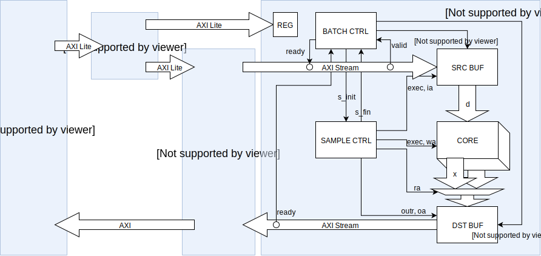
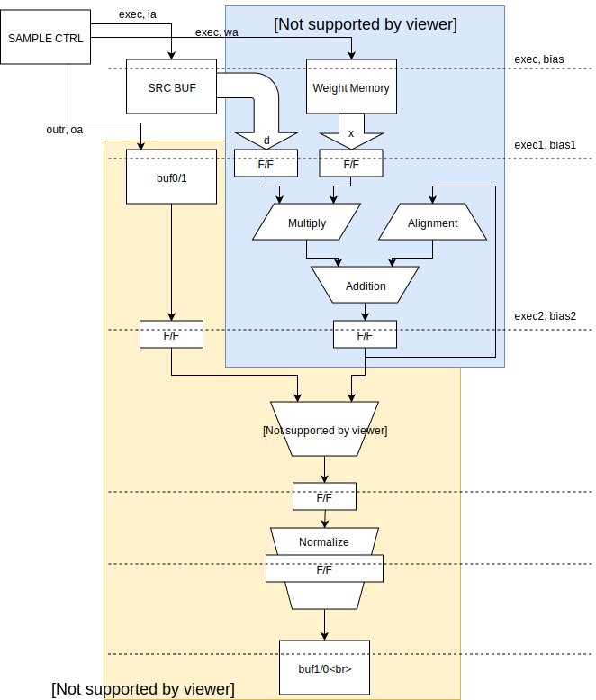

# tiny-dnn アクセラレータの構成

tiny-dnn の畳み込みレイヤを Zynq の PL 部に作ったアクセラレータ回路にオフロードすることで、CNN の学習を加速します。

## 概要

畳み込みの行列乗算を 16MAC で並列に計算して学習を加速します。  
AXI Stream で 1サンプル分のデータを受け取り、core で畳み込み計算をして、AXI Stream で 1サンプル分の結果を吐き出します。  
source buffer と destination buffer に 1サンプル分の入出力データを置くためのバッファを持ちます。  
ウェイト用のバッファは core 内に持ちます。  
sample controller で 1サンプル内の制御をして、batch controller でミニバッチ 1層の制御をします。  
im2col は on the fly で実行するので、転送データとバッファメモリを節約できます。



## 機能

疑似コードで書くとこんな感じです。  
ここでは順方向伝搬しか扱っていませんが、実際には逆方向誤差伝搬と、ΔWの計算もできます。  
ΔW をミニバッチ内の全 sample 分だけ累積するため、dst_buf 内に加算器を持ちます。

parallel for の中身が上の図の CORE 部分で、この実装では最大 16です。  
src_buf と weight_memory のデータ型は bfloat16、dst_buf のデータ型は single です。  
sum のデータ型は独自データ型で、符号、指数部はそれぞれ 1bit と 8bit で 32bit Float 型と同じですが、仮数部は正規化前の 32bit のデータを保持します。

```ｃ
for(int iy=0; iy<oh; iy++){
  for(int ix=0; ix<ow; ix++){

    reset(sum);

    for(int ic=0; ic<id; ic++){
      for(int fy=0; fy<kh; fy++){
        for(int fx=0; fx<kw; fx++){
          int ia = ia(ic,iy,ix);
          int wa = wa(ic,fy,fx);
          bfloat16 d = src_buf[ia];

# parallel for
          for(int oc=0; oc<od; oc++){
            bfloat16 w[oc] = weight_memory[wa];
            sum[oc] += d * w[oc];
          }

        }
      }
    }

    for(int oc=0; oc<od; oc++){
      int oa = oa(oc,iy,ix);
      dst_buf[oa] = sum[oc];
    }

  }
}
```

## 演算器構成

アクセラレータの演算器の構成は、次のような5段パイプ構成です。  
全体的に、丸めは省略して切り捨てにしています。



#### 1サイクル目

ソースデータとウェイトの読み出しをします。  
共に bfloat16 型です。  
ソースデータはコアの外にあり、すべてのコアで共通の値を使います。  
ウェイトはコアごとに別々の値です。

#### 2サイクル目

積和演算です。  
指数を比較して、加数が十分に小さいときはアラインメント出力を 0 にします。  
乗算結果の指数が加数の指数よりも十分に小さいときは積和演算結果を更新しません。  
指数差が適度な場合は前回の積和演算結果をアラインしますが、アラインメントシフトでオーバーフローが発生した時も積和演算結果を更新しません。  
加数が正規化されている場合は指数の比較だけで十分ですが、中間データを正規化せずにフィートバックしているためにこの処理が必要になります。  
すべての条件に当てはまらない場合だけ、積和演算結果を使います。

#### 4,5サイクル目

正規化をして 32bit Float 型に変換します。  
正規化回路はコア外に 1個しかありません。

#### 2サイクル目 (ΔWのみ)

ΔW を累積するために、前回までの累積値を読み出します。

#### 3サイクル目 (ΔWのみ)

ΔW を累積します。

## 制御部構成

### sample controller

on the fly で im2col を実行するためのアドレスを生成します。  
batch controller からリクエストを受けて

1. カーネルごとに

- 入力データのアドレス(ia)を生成して入力データ(d)を取ってくる
- core にウェイトのアドレス(wa)と入力データ(d)を渡して計算する

2. 1カーネル分の計算が終わると出力データ(x)のアドレス(oa)を生成してデータを吐き出す
3. 終わったらストライド分(1限定だけど)だけ移動して、1サンプルの計算が終わるまで繰り返す

1サンプルの計算が終わると batch controller に知らせます。

### batch controller

CPU からリクエストを受けて

1. 入力側の AXI Stream の ready を上げて 1サンプル分のデータを受け取る
2. 入力側の AXI Stream の ready を下げて DMA を中断
3. sample controller にリクエストを投げて計算開始
4. sample controller から計算終了の通知を受けると 出力側の AXI Stream の valid を上げる
5. 1サンプル分のデータを出力したら valid をさげて、ミニバッチ分だけ繰り返す

ミニバッチが終わると CPU に制御を戻します。  
tini_dnn アクセラレータの設定はミニバッチごとに 1回ですが、DMA の設定は 1sample ごとに設定しなおします。

